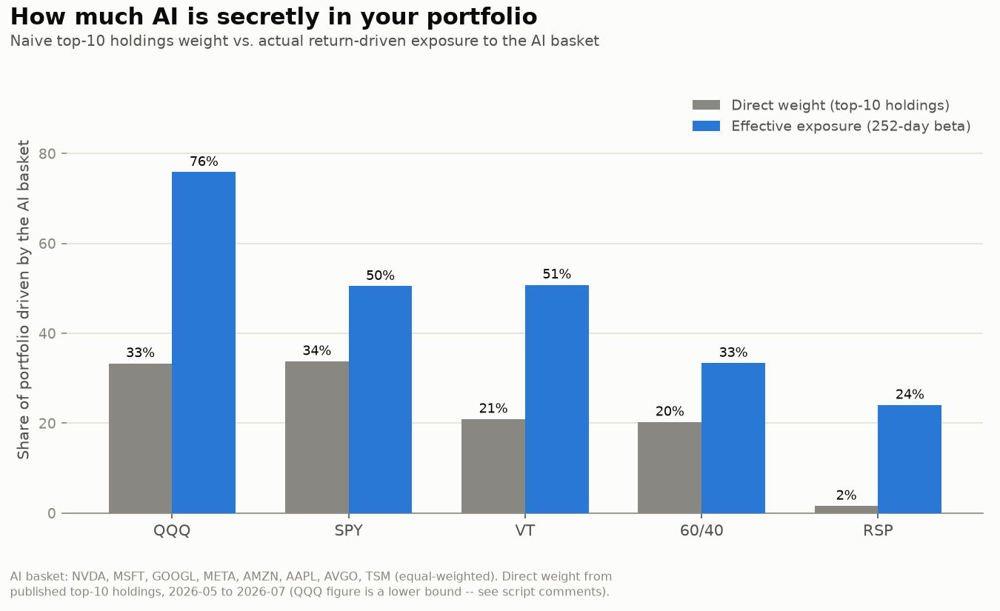

# The Hidden AI Portfolio

**You think you're diversified. You're holding an AI fund.**

A quantitative study of how much AI/mega-cap exposure sits inside portfolios people
believe are diversified — plus an interactive app that measures it for *your* portfolio.

🔗 **Live app: [portfolio-xray.streamlit.app](https://portfolio-xray.streamlit.app)** ·
📄 [Methodology](hidden_ai_portfolio_methodology.md) · ⚠️ [Limitations](LIMITATIONS.md)

> **What this project never claims:** that AI *is* a bubble, or that a crash *will*
> happen. Every crash-adjacent number is conditional — *"if a 2000-style repricing
> occurred…"*. The project measures sensitivity; it does not forecast.

---

## The findings in five sentences

1. **The S&P 500's top-10 holdings are 43% of the index today, versus 23% at the 2000
   dot-com peak** — concentration is now well above the level that preceded the last
   great repricing.
2. **Every "diversified" portfolio tested carries far more AI exposure than its holdings
   sheet suggests:** QQQ moves from a 33% direct weight to 75% effective exposure, SPY
   from 34% to 50%, and VT — a whole-world fund — from 21% to **50%**.
3. **Even the "least AI" fund isn't out of the trade:** equal-weight RSP holds under 2%
   of the AI basket directly, yet a quarter of its daily movement still tracks it. The
   only diversification that measurably reduced exposure was *across asset classes*
   (bonds), not across stocks or geographies.
4. **History says these crashes are selective, not uniform:** in 2000–2002 the Nasdaq
   fell 78% while value fell 34% — a concentration crash, not a market crash. 2022
   repeated the shape at smaller scale; 2008 did the opposite (value fell *harder*,
   while Treasuries rose).
5. **Applying those historical shocks to today's measured betas** gives a menu, not a
   recommendation: a dot-com-style repricing would imply −72% for QQQ and −39% for a
   60/40, while trend continuation implies +33% and +14% respectively. No portfolio
   wins on both axes — and this project deliberately declines to recommend a point on
   that line.

---

## Try it: the Portfolio X-Ray



The [live app](https://portfolio-xray.streamlit.app) takes any portfolio built from a
100-ticker universe (popular ETFs + widely held single stocks) and returns:

- its **effective AI exposure** (regression beta) vs. its **naive holdings weight**
- where it sits **among the standard portfolios** (QQQ / SPY / VT / 60-40 / RSP)
- its **projected outcome under four conditional scenarios** — no-bubble trend
  continuation, 2022-style, 2008-style, and dot-com-style repricings
- **when it became an AI fund** — a rolling 252-day beta timeline

---

## Research questions

| | Question | Module |
|---|---|---|
| **RQ1** | How much AI/mega-cap exposure do "standard advice" portfolios actually carry, and how does today's concentration compare to 2000? | M1 |
| **RQ2** | In the dot-com crash, 2008, and 2022 — what happened to cap-weighted vs. value vs. international vs. bonds vs. gold? | M2 |
| **RQ3** | What would today's measured exposures imply, conditionally, if the trend continued versus if a historical repricing repeated? | M3 |

---

## Methodology in brief

Full detail lives in [`hidden_ai_portfolio_methodology.md`](hidden_ai_portfolio_methodology.md)
and the per-module methodology files in [`outputs/`](outputs/).

### Data and the gate check

19 core tickers (later extended to 100 for the app) pulled once from **yfinance** at
daily adjusted close — max available history — into a local **SQLite** database. Every
analysis reads from the database, never from the internet, so re-runs are reproducible.

Before any analysis ran, the pipeline had to **reproduce a known fact**: SPY's 2022
peak-to-trough drawdown (documented at ≈ −25%). It returned **−24.5%** — the residual
explained by using daily closes rather than intraday extremes. *If a pipeline can't
reproduce a known number, nothing downstream can be trusted.* This gate is re-asserted
at the start of every module and on app startup.

### Module 1 — Hidden concentration (RQ1)

Two measures per portfolio, and the **gap between them is the finding**:

- **Direct weight** — the sum of AI-basket tickers in the fund's published top-10
  holdings. What a reasonable investor sees.
- **Effective exposure** — the **OLS beta** from regressing the portfolio's daily *log*
  returns on the equal-weighted AI basket's log returns over a trailing **252 trading
  days**. What the portfolio actually does.

Beta is readable as an exposure percentage because if X% of a portfolio were the basket
and the remaining (100−X)% were uncorrelated with it, beta would be ≈ X/100. When beta
*exceeds* the direct weight, the rest of the portfolio isn't neutral — it's full of names
riding the same trade.

*Pre-registered sanity checks (set before running):* QQQ must show the highest beta;
TLT (long Treasuries) must be ≈ 0. Both held — 0.75 and 0.05.

| Portfolio | Direct weight | Effective exposure (β) | R² |
|---|---|---|---|
| QQQ | 33.3%* | **0.75** | 0.76 |
| SPY | 33.8% | **0.50** | 0.75 |
| VT | 20.9% | **0.50** | 0.63 |
| 60/40 (synthetic) | 20.3% | **0.32** | 0.60 |
| RSP | 1.6% | **0.25** | 0.21 |
| TLT *(control)* | ~0% | 0.05 | 0.01 |

\* lower bound — see Limitations.

### Module 2 — What crashes actually looked like (RQ2)

Historical replay only, no projection. For each window: slice to the date range, index
each series to 100 at its first available date, and compute **max drawdown** as the
minimum of (price ÷ running maximum − 1). Pre-2003 the ETFs don't exist, so index
series (^GSPC, ^IXIC) and IWD stand in; substitutions and truncations are documented and
flagged on the charts.

| Window | Epicenter index | Cap-weighted | Value | Bonds |
|---|---|---|---|---|
| Dot-com (Mar 2000 – Oct 2002) | Nasdaq **−77.9%** | −49.1% | −34.1% | *no coverage* |
| GFC (Oct 2007 – Mar 2009) | −54%-range | **−56.8%** | −59.8% | TLT **+26.4%** (return) |
| 2022 (Jan – Oct 2022) | QQQ −34.8% | −24.5% | −17.0% | TLT −34.9% |

Three windows, three different failure modes of diversification: a **concentration
crash** (2000 — value barely felt it), a **systemic crash** (2008 — equity diversification
failed, bonds saved you), and a **rate shock** (2022 — stocks *and* bonds fell together).

### Module 3 — Conditional scenario projection (RQ3)

Each portfolio is regressed on **two factors** over the same 252-day window:

1. the equal-weighted **AI basket**, and
2. a **"rest of market" factor** — RSP's returns *residualized* against the AI basket
   (the OLS residual, orthogonal by construction).

Projected outcome ≈ `β_AI × AI_shock + β_rest × rest_shock`, with every shock read
**programmatically from Module 2's output table** — never hand-typed. Scenarios: trend
continuation ("no bubble"), 2022-style, 2008-style, and dot-com-style repricings.

| Portfolio | β AI | β rest | No bubble | 2022-style | Dot-com-style |
|---|---|---|---|---|---|
| QQQ | 0.75 | 0.41 | +33% | −33% | **−72%** |
| SPY | 0.50 | 0.52 | +22% | −26% | −57% |
| VT | 0.50 | 0.65 | +22% | −28% | −61% |
| 60/40 | 0.32 | 0.41 | +14% | −18% | −39% |
| RSP | 0.25 | 1.00† | +11% | −26% | −54% |
| TLT *(control)* | 0.05 | 0.23 | +2% | −6% | −12% |

† tautological — RSP builds the rest factor; read that row as a mechanical reference
point, not an independent result.

A finding that surfaced only after running the numbers: **the 60/40's 2008-style
projection (−41%) is *worse* than its dot-com-style one (−39%)** — because 2008's
non-epicenter shock (−59.8%) ran far deeper than 2000's (−34.1%). Being "less AI" is
not protection against every kind of crash.

---

## Techniques used

`OLS regression (statsmodels)` · `rolling 252-day windows` · `two-factor decomposition
with residualized orthogonal factors` · `log vs. simple return conventions` ·
`max drawdown (running-max method)` · `SQL / SQLite data layer` · `pandas` ·
`matplotlib + plotly` · `Streamlit` · `pytest (16 tests, incl. pipeline gate check)`

---

## Repo structure

```
hidden-ai-portfolio/
├── app/xray_app.py            # the Portfolio X-Ray Streamlit app
├── analysis/
│   ├── factor_lib.py          # shared machinery: basket, betas, scenarios
│   ├── m1_concentration.py    # RQ1 — hidden concentration
│   ├── m2_replay.py           # RQ2 — crash replays
│   └── m3_scenarios.py        # RQ3 — conditional projections
├── data/
│   ├── pull_prices.py         # yfinance → SQLite
│   ├── schema.sql
│   └── prices.db              # 100 tickers, daily adjusted close
├── outputs/                   # charts, findings, per-module methodology, CSVs
├── tests/                     # pytest suite incl. the gate check
├── hidden_ai_portfolio_methodology.md
└── LIMITATIONS.md
```

The app and the research **share one implementation** (`factor_lib.py`) — the numbers in
the app are computed by the same code that produced the charts, not a reimplementation.

---

## Run it locally

```bash
git clone https://github.com/IlanNir664/hidden-ai-portfolio.git
cd hidden-ai-portfolio
pip install -r requirements.txt

streamlit run app/xray_app.py     # the app
python analysis/m1_concentration.py   # reproduce the research
pytest                                 # 16 tests, incl. the gate check
```

The database ships with the repo, so everything runs offline from a clean clone.
`data/pull_prices.py` refreshes it.

---

## Limitations (the short version)

Written alongside the analysis, not after it. Full list in [`LIMITATIONS.md`](LIMITATIONS.md).

- **The AI basket is hindsight-selected** — eight names already known to be the winners.
  Sensitivity to alternative basket definitions is planned, not yet tested.
- **Linear beta understates crash correlations.** Correlations rise in drawdowns, so
  calm-period betas likely *understate* real crash exposure — this limitation works
  against the headline findings, not for them.
- **The shock mapping is an analogy, not an identity.** "Nasdaq in 2000 ≈ the AI basket
  today" is a structural parallel between concentrated leaders, not the same instruments.
  The 2008 mapping is the weakest of the three — tech wasn't that crash's epicenter.
- **The rest-of-market factor isn't investable.** It's a modeling device (an OLS
  residual), and multiplying a calm-period beta by a crash-scale shock is a
  simplification.
- **Scenario ≠ forecast**, and point-in-time figures drift with the market.

---

## Roadmap

| Stage | Status |
|---|---|
| M0 — pipeline + gate check | ✅ |
| M1 — hidden concentration | ✅ |
| M2 — crash replays (2000 / 2008 / 2022) | ✅ |
| M3 — conditional scenario projection | ✅ |
| M4 — the Portfolio X-Ray app | ✅ |
| Basket sensitivity (v2 cap-weighted, v3 ±TSLA/AMD/PLTR) | planned |
| Bootstrap stress distributions; hindsight-free 2015 basket | planned |

---

*Educational research project — **not investment advice**. Nothing here recommends any
portfolio, weight, or action.*

**Built by [YOUR NAME]** · [LinkedIn](https://linkedin.com/in/YOUR-PROFILE) ·
[GitHub](https://github.com/IlanNir664)
